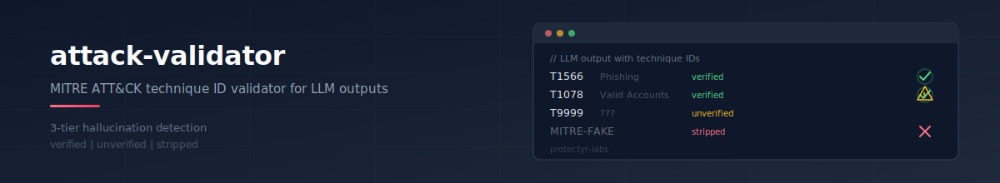
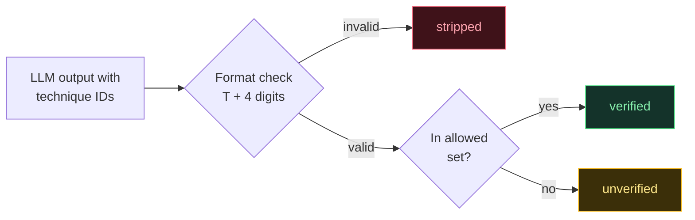

<p align="center">
  
</p>

<p align="center">
  MITRE ATT&CK technique ID validator for LLM outputs.<br/>
  3-tier hallucination detection: verified, unverified, stripped.
</p>

<p align="center">
  <a href="https://github.com/protectyr-labs/attack-validator/actions/workflows/ci.yml"></a>
  <a href="https://www.npmjs.com/package/@protectyr-labs/attack-validator"></a>
  <a href="./LICENSE"></a>
  <a href="https://www.typescriptlang.org/"></a>
</p>

---

## The problem

LLMs generating security analysis hallucinate MITRE ATT&CK technique IDs. A fabricated T-number in a threat report destroys credibility with the security team reading it.

Binary valid/invalid classification is not enough. A technique ID like `T9999` has valid format but may not exist in ATT&CK, or it may be a real technique your curated list did not include. You need a third category.

## Quick start

```bash
npm install @protectyr-labs/attack-validator
```

```typescript
import { validateTechniqueIds } from '@protectyr-labs/attack-validator';

const allowed = new Set(['T1566', 'T1566.001', 'T1078', 'T1059']);

const result = validateTechniqueIds(
  ['T1566', 'T9999', 'HALLUCINATED', 'T1078'],
  allowed,
);

// result.verified   => ['T1566', 'T1078']
// result.unverified => ['T9999']          -- valid format, not in set
// result.stripped   => ['HALLUCINATED']   -- invalid format
```

## How it works



| Tier | Meaning | Action |
|------|---------|--------|
| verified | Valid format AND in your allowed set | Keep in output |
| unverified | Valid format but unknown | Flag for human review |
| stripped | Invalid format | Discard -- hallucinated |

## Use cases

**Security analysis pipelines.** Your LLM analyzes evidence and outputs ATT&CK technique IDs. Some are real, some are hallucinated. This validator separates them without losing real findings.

**Threat intelligence reports.** Auto-generated threat reports reference ATT&CK techniques. Before publishing, validate that every referenced technique exists and matches the incident type.

**Compliance auditing.** Mapping incidents to ATT&CK is required by some compliance frameworks. Validated technique IDs are audit-ready; unverified ones are flagged for human review.

## API

| Function | Description |
|----------|-------------|
| `validateTechniqueId(id, allowedIds)` | Single ID -- returns `verified`, `unverified`, or `stripped` |
| `validateTechniqueIds(ids, allowedIds)` | Array of IDs -- returns categorized object |
| `validateAnalysisResult(result, allowedIds)` | Full analysis object -- moves unverified to separate field, strips invalid |
| `isValidFormat(id)` | Format check only (`TNNNN` or `TNNNN.NNN`) |

## Design decisions

**3 tiers, not binary.** A technique ID with valid format but missing from your curated list could be a real technique the LLM correctly identified. Dropping it loses signal. Keeping it unchecked is risky. The unverified tier preserves the finding while flagging it for human review.

**Regex for format validation.** ATT&CK IDs follow a strict pattern: `T` + 4 digits, optionally `.` + 3 digits for sub-techniques. A regex check is deterministic, runs in microseconds, and requires no network calls or external dependencies.

**Per-incident-type allowed lists.** The full ATT&CK matrix has 200+ techniques. Validating against the entire set catches format errors but not relevance errors. A phishing incident should not reference hardware firmware techniques. Scoped allowed lists reduce the hallucination surface.

**No live database.** This library does not fetch or embed the full ATT&CK catalog. It validates format and checks against a set you provide. If you need full-catalog validation, combine this with a technique list from the ATT&CK STIX data or the ATT&CK API.

## Limitations

- Curated lists only -- does not validate against the full ATT&CK database
- Manual maintenance -- allowed lists need updating as ATT&CK evolves
- Format-only validation -- a valid-format ID like `T9999` may not exist in ATT&CK
- No semantic validation -- `T1566` (Phishing) in a finding about disk encryption is syntactically correct but semantically wrong

## Origin

Built for [OTP2](https://github.com/protectyr-labs), a security assessment platform where LLM-generated findings reference ATT&CK techniques. Extracted as a standalone library because the validation logic is useful anywhere LLMs produce technique IDs.

> [!NOTE]
> This library validates technique ID format and set membership. It does not replace the official [MITRE ATT&CK knowledge base](https://attack.mitre.org/) for technique lookup or semantic validation.

## See also

- [prompt-shield](https://github.com/protectyr-labs/prompt-shield) -- detect prompt injection before LLM processing

## License

MIT
